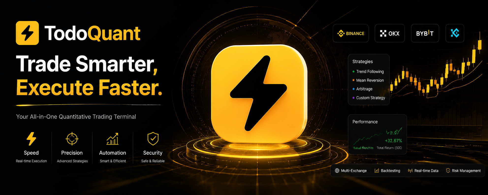

<div align="center">
  
</div>

# TodoQuant

Crypto trading automation platform for OKX & Binance.

## Features

- Multi-account monitoring (OKX & Binance)
- Order management: place, amend, cancel, close, margin
- Chase limit orders for instant market entry
- DIY strategy engine with condition blocks
- Freqtrade integration for backtesting
- Real-time WebSocket data feeds
- Privacy mode for account value masking
- Electron desktop app with auto-update

## Quick Start

```bash
npm install
npm run dev
```

Open http://localhost:3000 in your browser.

## Build Desktop App

```bash
npm run electron:build:local
```

## Tech Stack

- Frontend: React 19 + TypeScript + Tailwind CSS v4
- Backend: Express + WebSocket + SQLite (better-sqlite3)
- Desktop: Electron
- Trading: OKX REST/WebSocket API, Binance SDK
- i18n: zh-CN / en-US

## License

All rights reserved. Source code is provided for viewing and evaluation purposes only. Commercial use, redistribution, and derivative works are prohibited without explicit written permission.

## Contact

For collaboration or licensing inquiries, please reach out via the project's GitHub page.
